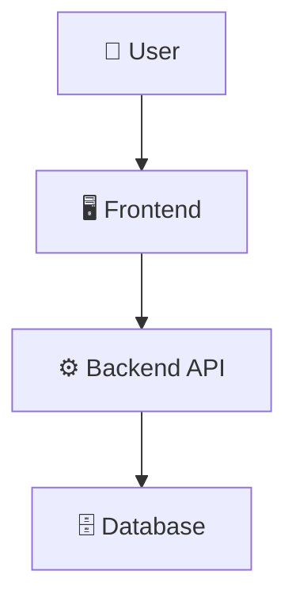
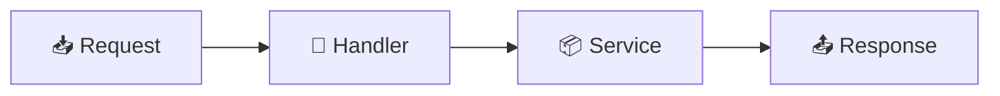

# 🗺️ Data Flow Diagrams

> This file is automatically maintained by the AI DevDocs Engine.
> Mermaid diagrams inside `<!-- AI:START:* -->` blocks are AI-managed.
> Add your own diagrams **outside** these blocks.

---

<!-- AI:START:SYSTEM_DFD -->
### 🗺️ System-Level Data Flow

<!-- AI:END:SYSTEM_DFD -->

---

<!-- AI:START:FEATURE_DFD -->
### ⚙️ Feature / Module Data Flow
_Based on: Initial template_

<!-- AI:END:FEATURE_DFD -->

---

<!-- AI:START:CHANGE_SUMMARY -->
### 📝 Diagram Change Notes
- _Initial template. Push a commit to generate real diagrams._
<!-- AI:END:CHANGE_SUMMARY -->

---

<!-- MANUAL: Add your own diagrams below -->
